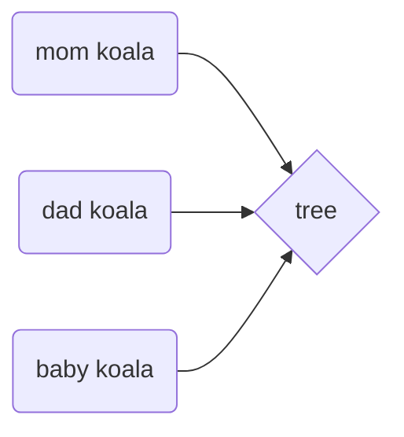
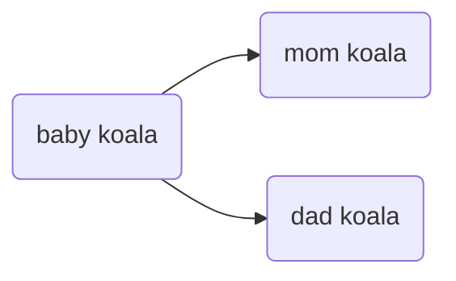

Accoring to [livescience](https://www.livescience.com/27401-koalas-facts.html):

> They live in eucalyptus trees and spend most of their time wedged between forks in the tree's branches. Koalas eat in the trees, sleep in trees and hang out in trees. The only time they leave the trees is to walk to another tree with a better food supply. Koalas do move around in their chosen tree.

So we're going to have koalas in our app. And they belong to a tree.

But as you can see we have a koala family in here, so we also have **another type of relation** -  koalas may belong to other koalas:

# Prerequisites

- I assume you are a front-end developer and you look for an easy way to build an API to be consumed by your app. You understand basic concepts of programming e.g. data structures or variables definitions.
- I also want you to do the [Try Ruby](https://ruby.github.io/TryRuby/) tutorial first, to have a grasp of ruby language ideas. At the website they claim it takes 30 minutes 😉.
